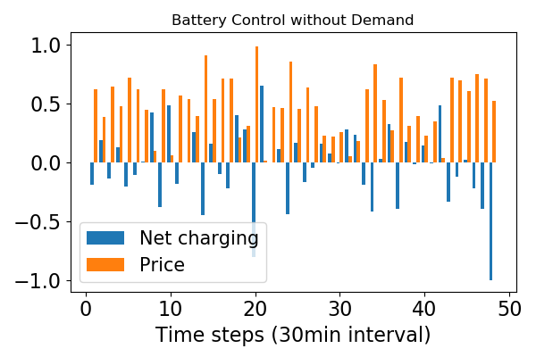
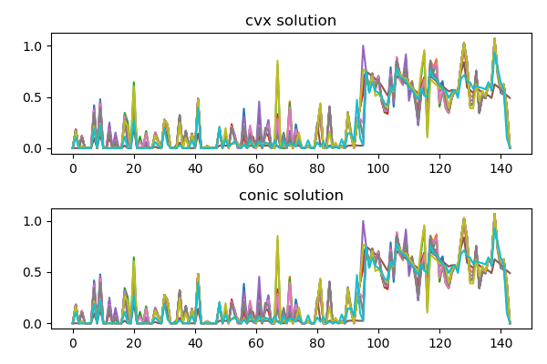
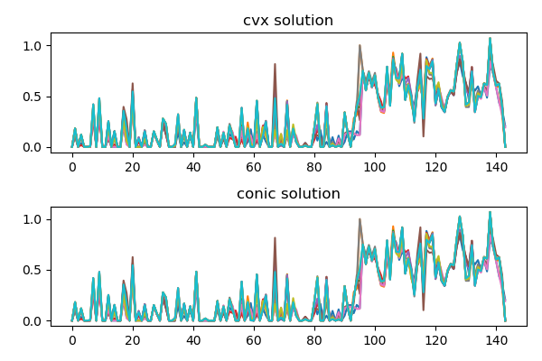
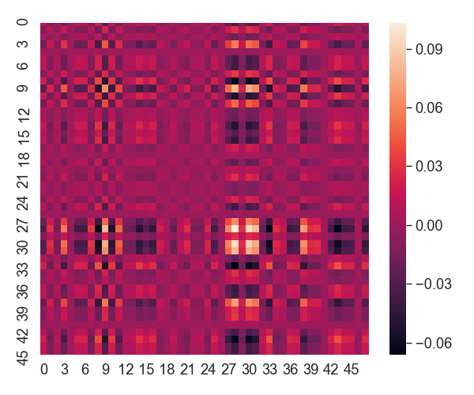
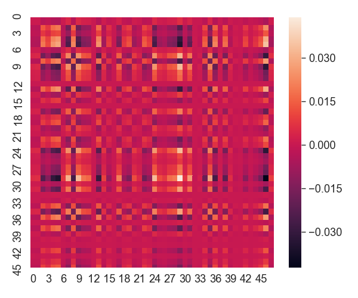
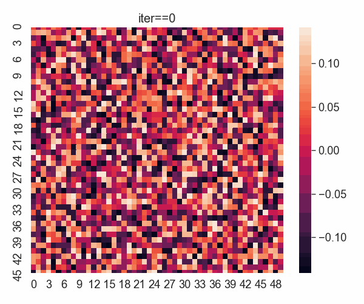
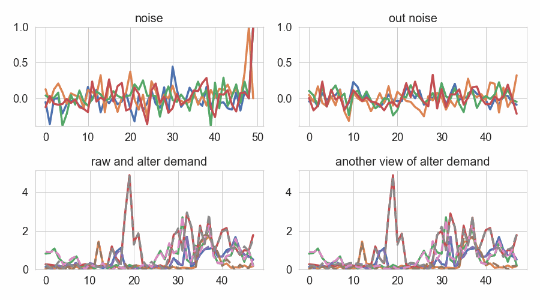

# Private DER control based on Time Series Meter Data


## Setup and Dependencies

+ Python 3.x/numpy/scipy/[cvxpy](http://www.cvxpy.org/en/latest/)
+ [PyTorch](https://pytorch.org) >= 0.4.1  [recommend version >=1.1.0]
+ pandas >= 23.0
+ matplotlib, seaborn (optional)

if using GPU, setup CUDA (optional). 

#### Notes:
- the encoding format is "**ISO-8859-1**" 

#### Irish Data \& References 
[Data] http://www.ucd.ie/issda/data/commissionforenergyregulationcer/

[Paper] https://www.vs.inf.ethz.ch/publ/papers/beckel-2014-energy.pdf


***
#### Run "battery control" problem 

* Example1: Run CVXPY to solve a basic battery control problem:


```
Parameter OutputFlag unchanged
   Value: 1  Min: 0  Max: 1  Default: 1
Changed value of parameter QCPDual to 1
   Prev: 0  Min: 0  Max: 1  Default: 0
Optimize a model with 386 rows, 291 columns and 673 nonzeros
Model has 1 quadratic constraint
Coefficient statistics:
  Matrix range     [9e-01, 2e+00]
  QMatrix range    [1e+00, 1e+00]
  Objective range  [1e-02, 1e+00]
  Bounds range     [0e+00, 0e+00]
  RHS range        [8e-01, 2e+00]
Presolve removed 290 rows and 146 columns
Presolve time: 0.00s
Presolved: 97 rows, 146 columns, 238 nonzeros
Presolved model has 1 second-order cone constraint
Ordering time: 0.00s

Barrier statistics:
 Dense cols : 1
 AA' NZ     : 1.880e+02
 Factor NZ  : 9.360e+02
 Factor Ops : 1.117e+04 (less than 1 second per iteration)
 Threads    : 1

                  Objective                Residual
Iter       Primal          Dual         Primal    Dual     Compl     Time
   0  -2.55282456e+01 -9.33787274e+01  1.31e+01 1.10e+00  7.20e+00     0s
   1  -2.25931579e+00 -8.09404984e+01  6.39e-01 1.08e-01  6.70e-01     0s
   2  -1.40179651e+00 -2.79723323e+01  7.02e-07 1.57e-02  1.25e-01     0s
   3  -2.78746396e+00 -5.67043537e+00  1.89e-07 6.77e-04  1.34e-02     0s
   4  -3.92196808e+00 -5.03309703e+00  2.57e-08 9.33e-05  5.14e-03     0s
   5  -4.02668276e+00 -4.38988685e+00  9.53e-13 2.78e-05  1.68e-03     0s
   6  -4.21956634e+00 -4.26314712e+00  6.61e-12 7.35e-07  2.01e-04     0s
   7  -4.24889183e+00 -4.25071550e+00  3.85e-12 4.35e-08  8.41e-06     0s
   8  -4.24932162e+00 -4.24942557e+00  2.49e-10 1.38e-09  4.79e-07     0s
   9  -4.24938763e+00 -4.24939642e+00  1.29e-09 5.28e-12  4.05e-08     0s
  10  -4.24939499e+00 -4.24939523e+00  2.72e-09 2.12e-13  1.14e-09     0s

Barrier solved model in 10 iterations and 0.01 seconds
Optimal objective -4.24939499e+00

Solving KKT system to obtain QCP duals...

Optimize a model with 387 rows, 291 columns and 741 nonzeros
Coefficient statistics:
  Matrix range     [2e-10, 4e+01]
  Objective range  [1e-11, 4e+01]
  QObjective range [2e+00, 2e+00]
  Bounds range     [0e+00, 0e+00]
  RHS range        [3e-06, 2e+00]
Presolve removed 148 rows and 4 columns
Presolve time: 0.01s
Presolved: 239 rows, 287 columns, 588 nonzeros
Ordering time: 0.00s

Barrier statistics:
 AA' NZ     : 5.760e+02
 Factor NZ  : 1.815e+03
 Factor Ops : 1.653e+04 (less than 1 second per iteration)
 Threads    : 1

                  Objective                Residual
Iter       Primal          Dual         Primal    Dual     Compl     Time
   0   3.59620589e+07 -3.65246580e+07  1.00e+03 1.00e+03  1.00e+06     0s
   1   3.61887641e+06 -4.01107634e+06  2.01e+02 2.01e+02  2.12e+05     0s
   2   7.69388234e+04 -5.32454179e+05  9.41e+00 9.41e+00  1.34e+04     0s
   3   9.34576620e+03 -3.49488930e+05  9.41e-06 9.41e-06  1.25e+03     0s
   4   9.11376481e+02 -6.01602064e+03  8.78e-08 8.78e-08  2.41e+01     0s
   5   1.16350953e+02 -8.12217012e+02  1.35e-09 1.35e-09  3.22e+00     0s
   6   1.02506843e+01 -1.66882338e+02  1.24e-14 3.55e-15  6.15e-01     0s
   7  -1.81415509e+00 -8.80573899e+00  2.22e-15 4.44e-16  2.43e-02     0s
   8  -3.93577641e+00 -4.52773990e+00  2.22e-15 4.44e-16  2.06e-03     0s
   9  -4.20268933e+00 -4.27561573e+00  2.22e-15 3.55e-15  2.53e-04     0s
  10  -4.24067258e+00 -4.26684547e+00  2.22e-15 4.44e-16  9.09e-05     0s
  11  -4.24762529e+00 -4.25477786e+00  4.88e-15 4.44e-16  2.48e-05     0s
  12  -4.24927986e+00 -4.24977299e+00  4.88e-15 3.55e-15  1.71e-06     0s
  13  -4.24939358e+00 -4.24939801e+00  2.22e-15 4.44e-16  1.54e-08     0s
  14  -4.24939505e+00 -4.24939520e+00  2.22e-15 4.44e-16  5.06e-10     0s

Barrier solved model in 14 iterations and 0.01 seconds
Optimal objective -4.24939505e+00
```

  
  

***
We did a runtime test comparing CVX-GROUBI, CVX-CVXOPT, DIFFCP 
1. **CVX-GROUBI** takes 0.023 second, 
2. **CVX-CVXOPT** takes 0.035 second, 
3. **DIFFCP** takes 0.0035 second (x10 faster)

```python
     pcost       dcost       gap    pres   dres   k/t
 0: -8.5285e-01 -2.1208e+00  1e+02  1e+01  4e+00  1e+00
 1: -1.1381e+00  9.2365e-02  6e+00  2e+00  6e-01  2e+00
 2: -1.0803e+00 -9.4980e-01  6e-01  2e-01  8e-02  2e-01
 3: -1.1664e+00 -1.1523e+00  7e-02  3e-02  9e-03  2e-02
 4: -1.1755e+00 -1.1738e+00  9e-03  3e-03  1e-03  2e-03
 5: -1.1769e+00 -1.1766e+00  2e-03  8e-04  3e-04  5e-04
 6: -1.1770e+00 -1.1770e+00  1e-03  4e-04  1e-04  2e-04
 7: -1.1772e+00 -1.1772e+00  5e-05  2e-05  6e-06  7e-06
 8: -1.1772e+00 -1.1772e+00  1e-06  4e-07  2e-07  9e-08
 9: -1.1772e+00 -1.1772e+00  4e-08  1e-08  4e-09  2e-09
Optimal solution found.
[CVX - CVXOPT] Compute solution : 0.0353 s.
Academic license - for non-commercial use only
Parameter OutputFlag unchanged
   Value: 1  Min: 0  Max: 1  Default: 1
Changed value of parameter QCPDual to 1
   Prev: 0  Min: 0  Max: 1  Default: 0
Optimize a model with 82 rows, 63 columns and 141 nonzeros
Model has 1 quadratic constraint
Coefficient statistics:
  Matrix range     [9e-01, 2e+00]
  QMatrix range    [1e+00, 1e+00]
  Objective range  [2e-01, 7e-01]
  Bounds range     [0e+00, 0e+00]
  RHS range        [8e-01, 2e+00]
Presolve removed 62 rows and 32 columns
Presolve time: 0.00s
Presolved: 21 rows, 32 columns, 48 nonzeros
Presolved model has 1 second-order cone constraint
Ordering time: 0.00s

Barrier statistics:
 Dense cols : 1
 AA' NZ     : 3.600e+01
 Factor NZ  : 1.100e+02
 Factor Ops : 7.300e+02 (less than 1 second per iteration)
 Threads    : 1

                  Objective                Residual
Iter       Primal          Dual         Primal    Dual     Compl     Time
   0  -6.59758992e+00 -1.43068768e+01  6.26e+00 8.08e-01  3.49e+00     0s
   1  -3.46990218e-01 -1.14530660e+01  6.88e-06 2.54e-03  2.42e-01     0s
   2  -8.27114260e-01 -2.01352986e+00  7.57e-12 1.91e-04  2.58e-02     0s
   3  -1.01523682e+00 -1.26379404e+00  1.42e-14 9.34e-06  5.41e-03     0s
   4  -1.16730935e+00 -1.19005195e+00  1.87e-14 2.90e-07  4.94e-04     0s
   5  -1.17339695e+00 -1.17813502e+00  3.79e-13 5.22e-08  1.03e-04     0s
   6  -1.17697485e+00 -1.17728617e+00  3.22e-14 2.64e-10  6.77e-06     0s
   7  -1.17716632e+00 -1.17720091e+00  1.42e-11 4.97e-12  7.52e-07     0s
   8  -1.17719777e+00 -1.17719935e+00  6.14e-10 3.78e-13  3.43e-08     0s

Barrier solved model in 8 iterations and 0.00 seconds
Optimal objective -1.17719777e+00

Solving KKT system to obtain QCP duals...


[CVX - GUROBI] Compute solution : 0.0227 s.
[DIFFCP] Compute solution and set up derivative: 0.0035 s.
``` 

***
Comparison in batched solvers

Ex. random batch 1 


Ex. random batch 2



***
For the stochastic optimization:

<a href="https://www.codecogs.com/eqnedit.php?latex=\dpi{120}&space;\large&space;\mathbb{E}_{\varepsilon}&space;[\frac{1}{2}x^TQx&space;&plus;&space;q^Tx&space;&plus;&space;p^T(d&plus;\Gamma\varepsilon)_{&plus;}&space;]&space;\\&space;s.t.\\&space;\quad&space;\textbf{Prob}\{&space;(d&plus;\Gamma\varepsilon)&space;>&space;0&space;)\}&space;\geq&space;1&space;-&space;\delta&space;\\&space;\quad&space;\textbf{Prob}\{&space;(x_i&space;-&space;x_o&space;&plus;&space;d&space;&plus;&space;\Gamma\varepsilon)&space;>&space;0&space;\}&space;\geq&space;1&space;-&space;\delta" target="_blank">&space;0&space;)\}&space;\geq&space;1&space;-&space;\delta&space;\\&space;\quad&space;\textbf{Prob}\{&space;(x_i&space;-&space;x_o&space;&plus;&space;d&space;&plus;&space;\Gamma\varepsilon)&space;>&space;0&space;\}&space;\geq&space;1&space;-&space;\delta" title="\large \mathbb{E}_{\varepsilon} [\frac{1}{2}x^TQx + q^Tx + p^T(d+\Gamma\varepsilon)_{+} ] \\ s.t.\\ \quad \textbf{Prob}\{ (d+\Gamma\varepsilon) > 0 )\} \geq 1 - \delta \\ \quad \textbf{Prob}\{ (x_i - x_o + d + \Gamma\varepsilon) > 0 \} \geq 1 - \delta" /></a>

remaining constraints...  


## 
Another pass of solving SDP formulation: 

```python
Problem
  Name                   :                 
  Objective sense        : min             
  Type                   : CONIC (conic optimization problem)
  Constraints            : 21652           
  Cones                  : 49              
  Scalar variables       : 13420           
  Matrix variables       : 2               
  Integer variables      : 0               

Optimizer started.
Presolve started.
Linear dependency checker started.
Linear dependency checker terminated.
Eliminator started.
Freed constraints in eliminator : 7198
Eliminator terminated.
Eliminator started.
Freed constraints in eliminator : 0
Eliminator terminated.
Eliminator - tries                  : 2                 time                   : 0.00            
Lin. dep.  - tries                  : 1                 time                   : 0.00            
Lin. dep.  - number                 : 0               
Presolve terminated. Time: 0.02    
Problem
  Name                   :                 
  Objective sense        : min             
  Type                   : CONIC (conic optimization problem)
  Constraints            : 21652           
  Cones                  : 49              
  Scalar variables       : 13420           
  Matrix variables       : 2               
  Integer variables      : 0               

Optimizer  - threads                : 12              
Optimizer  - solved problem         : the primal      
Optimizer  - Constraints            : 12745
Optimizer  - Cones                  : 50
Optimizer  - Scalar variables       : 4949              conic                  : 4851            
Optimizer  - Semi-definite variables: 2                 scalarized             : 5832            
Factor     - setup time             : 4.16              dense det. time        : 0.00            
Factor     - ML order time          : 1.32              GP order time          : 0.00            
Factor     - nonzeros before factor : 4.57e+07          after factor           : 5.96e+07        
Factor     - dense dim.             : 24                flops                  : 3.63e+11        
ITE PFEAS    DFEAS    GFEAS    PRSTATUS   POBJ              DOBJ              MU       TIME  
0   3.4e+00  1.0e+00  1.0e+00  0.00e+00   7.500000298e-02   7.500000298e-02   1.0e+00  4.19  
1   2.2e+00  6.5e-01  9.7e-01  1.84e+00   1.097708454e+01   1.079751833e+01   6.5e-01  10.28 
2   1.1e+00  3.3e-01  8.5e-01  1.54e+00   2.576035932e+01   2.557483311e+01   3.3e-01  15.72 
3   1.2e-01  3.7e-02  4.9e-01  1.54e+00   1.718685528e+01   1.714630937e+01   3.7e-02  21.48 
4   1.7e-02  4.9e-03  1.7e-01  1.20e+00   1.458902876e+01   1.458456633e+01   4.9e-03  27.29 
5   5.8e-03  1.7e-03  1.1e-01  1.00e+00   1.443021376e+01   1.442858883e+01   1.7e-03  32.86 
6   8.1e-04  2.4e-04  4.1e-02  1.00e+00   1.434544192e+01   1.434520776e+01   2.4e-04  38.75 
7   3.1e-04  9.1e-05  2.5e-02  1.00e+00   1.433510769e+01   1.433501940e+01   9.1e-05  44.33 
8   4.0e-05  1.2e-05  1.2e-05  1.00e+00   1.432987998e+01   1.432986879e+01   1.2e-05  50.00 
Optimizer terminated. Time: 50.04   


Interior-point solution summary
  Problem status  : PRIMAL_AND_DUAL_FEASIBLE
  Solution status : OPTIMAL
  Primal.  obj: 1.4329879984e+01    nrm: 2e+01    Viol.  con: 1e-05    var: 0e+00    barvar: 0e+00    cones: 0e+00  
  Dual.    obj: 1.4329868790e+01    nrm: 3e+00    Viol.  con: 1e-05    var: 9e-06    barvar: 9e-06    cones: 0e+00  
Obj value: 14.3299
[CVX - MOSEK] Compute solution : 50.7230 s.

 inside the cvx np filter : 48 144
[(144, 144), (144, 1), (288, 144), (288, 1), (48, 144), (48, 1)]
----------------------------------------------------------------------------
	SCS v1.2.6 - Splitting Conic Solver
	(c) Brendan O'Donoghue, Stanford University, 2012-2016
----------------------------------------------------------------------------
Lin-sys: sparse-indirect, nnz in A = 25657, CG tol ~ 1/iter^(2.00)
eps = 1.00e-03, alpha = 1.50, max_iters = 2500, normalize = 1, scale = 1.00
Variables n = 10922, constraints m = 15964
Cones:	primal zero / dual free vars: 7200
	linear vars: 434
	soc vars: 2498, soc blks: 49
	sd vars: 5832, sd blks: 2
Setup time: 1.27e-03s
----------------------------------------------------------------------------
 Iter | pri res | dua res | rel gap | pri obj | dua obj | kap/tau | time (s)
----------------------------------------------------------------------------
     0|      inf       inf       nan      -inf       inf       inf  1.14e-01 
   100| 2.70e-02  1.26e-02  3.51e-04  1.41e+01  1.41e+01  6.99e-15  5.42e-01 
   200| 5.50e-03  1.71e-03  3.94e-04  1.45e+01  1.45e+01  7.16e-15  9.50e-01 
   300| 7.74e-04  5.30e-04  1.82e-05  1.45e+01  1.45e+01  7.20e-15  1.36e+00 
----------------------------------------------------------------------------
Status: Solved
Timing: Solve time: 1.36e+00s
	Lin-sys: avg # CG iterations: 6.77, avg solve time: 1.01e-03s
	Cones: avg projection time: 3.31e-03s
----------------------------------------------------------------------------
Error metrics:
dist(s, K) = 1.8905e-09, dist(y, K*) = 1.7984e-09, s'y/|s||y| = -4.5121e-12
|Ax + s - b|_2 / (1 + |b|_2) = 7.7399e-04
|A'y + c|_2 / (1 + |c|_2) = 5.3005e-04
|c'x + b'y| / (1 + |c'x| + |b'y|) = 1.8171e-05
----------------------------------------------------------------------------
c'x = 14.5379, -b'y = 14.5374
============================================================================
Obj value: 14.5379
[CVX - SCS] Compute solution : 1.6535 s.
```

The filter weight (based on a random vector and single demand) can be visualized as

 
 

 


___
Crude check for the filter weights 





One caveat objective   
 
<a href="https://www.codecogs.com/eqnedit.php?latex=p^Tx_i&space;&plus;&space;p^Tx_o&space;&plus;&space;p^T(x_i&space;&plus;&space;x_o&plus;d&plus;\Gamma&space;\varepsilon)_{&plus;}&space;&plus;&space;\beta_3(x_s&space;-&space;\alpha&space;B)^T(x_s&space;-&space;\alpha&space;B)&space;&plus;&space;\beta_1&space;x_i^Tx_i&space;&plus;&space;\beta_2&space;x_o^Tx_o" target="_blank"></a>