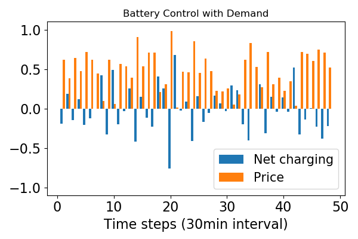

# Private DER control based on Time Series Meter Data


## Setup and Dependencies

+ Python 3.x/numpy/scipy/[cvxpy](http://www.cvxpy.org/en/latest/)
+ [PyTorch](https://pytorch.org) >= 0.4.1  [recommend version >=1.1.0]
+ pandas >= 23.0
+ matplotlib, seaborn (optional)

if using GPU, setup CUDA (optional). 

#### Notes:
- the encoding format is "**ISO-8859-1**" 

#### Irish Data \& References 
[Data] http://www.ucd.ie/issda/data/commissionforenergyregulationcer/

[Paper] https://www.vs.inf.ethz.ch/publ/papers/beckel-2014-energy.pdf


***
#### Run "battery control" problem 

* Example1: Run CVXPY to solve a basic battery control problem:


```
Parameter OutputFlag unchanged
   Value: 1  Min: 0  Max: 1  Default: 1
Changed value of parameter QCPDual to 1
   Prev: 0  Min: 0  Max: 1  Default: 0
Optimize a model with 386 rows, 291 columns and 673 nonzeros
Model has 1 quadratic constraint
Coefficient statistics:
  Matrix range     [9e-01, 2e+00]
  QMatrix range    [1e+00, 1e+00]
  Objective range  [1e-02, 1e+00]
  Bounds range     [0e+00, 0e+00]
  RHS range        [8e-01, 2e+00]
Presolve removed 290 rows and 146 columns
Presolve time: 0.00s
Presolved: 97 rows, 146 columns, 238 nonzeros
Presolved model has 1 second-order cone constraint
Ordering time: 0.00s

Barrier statistics:
 Dense cols : 1
 AA' NZ     : 1.880e+02
 Factor NZ  : 9.360e+02
 Factor Ops : 1.117e+04 (less than 1 second per iteration)
 Threads    : 1

                  Objective                Residual
Iter       Primal          Dual         Primal    Dual     Compl     Time
   0  -2.55282456e+01 -9.33787274e+01  1.31e+01 1.10e+00  7.20e+00     0s
   1  -2.25931579e+00 -8.09404984e+01  6.39e-01 1.08e-01  6.70e-01     0s
   2  -1.40179651e+00 -2.79723323e+01  7.02e-07 1.57e-02  1.25e-01     0s
   3  -2.78746396e+00 -5.67043537e+00  1.89e-07 6.77e-04  1.34e-02     0s
   4  -3.92196808e+00 -5.03309703e+00  2.57e-08 9.33e-05  5.14e-03     0s
   5  -4.02668276e+00 -4.38988685e+00  9.53e-13 2.78e-05  1.68e-03     0s
   6  -4.21956634e+00 -4.26314712e+00  6.61e-12 7.35e-07  2.01e-04     0s
   7  -4.24889183e+00 -4.25071550e+00  3.85e-12 4.35e-08  8.41e-06     0s
   8  -4.24932162e+00 -4.24942557e+00  2.49e-10 1.38e-09  4.79e-07     0s
   9  -4.24938763e+00 -4.24939642e+00  1.29e-09 5.28e-12  4.05e-08     0s
  10  -4.24939499e+00 -4.24939523e+00  2.72e-09 2.12e-13  1.14e-09     0s

Barrier solved model in 10 iterations and 0.01 seconds
Optimal objective -4.24939499e+00

Solving KKT system to obtain QCP duals...

Optimize a model with 387 rows, 291 columns and 741 nonzeros
Coefficient statistics:
  Matrix range     [2e-10, 4e+01]
  Objective range  [1e-11, 4e+01]
  QObjective range [2e+00, 2e+00]
  Bounds range     [0e+00, 0e+00]
  RHS range        [3e-06, 2e+00]
Presolve removed 148 rows and 4 columns
Presolve time: 0.01s
Presolved: 239 rows, 287 columns, 588 nonzeros
Ordering time: 0.00s

Barrier statistics:
 AA' NZ     : 5.760e+02
 Factor NZ  : 1.815e+03
 Factor Ops : 1.653e+04 (less than 1 second per iteration)
 Threads    : 1

                  Objective                Residual
Iter       Primal          Dual         Primal    Dual     Compl     Time
   0   3.59620589e+07 -3.65246580e+07  1.00e+03 1.00e+03  1.00e+06     0s
   1   3.61887641e+06 -4.01107634e+06  2.01e+02 2.01e+02  2.12e+05     0s
   2   7.69388234e+04 -5.32454179e+05  9.41e+00 9.41e+00  1.34e+04     0s
   3   9.34576620e+03 -3.49488930e+05  9.41e-06 9.41e-06  1.25e+03     0s
   4   9.11376481e+02 -6.01602064e+03  8.78e-08 8.78e-08  2.41e+01     0s
   5   1.16350953e+02 -8.12217012e+02  1.35e-09 1.35e-09  3.22e+00     0s
   6   1.02506843e+01 -1.66882338e+02  1.24e-14 3.55e-15  6.15e-01     0s
   7  -1.81415509e+00 -8.80573899e+00  2.22e-15 4.44e-16  2.43e-02     0s
   8  -3.93577641e+00 -4.52773990e+00  2.22e-15 4.44e-16  2.06e-03     0s
   9  -4.20268933e+00 -4.27561573e+00  2.22e-15 3.55e-15  2.53e-04     0s
  10  -4.24067258e+00 -4.26684547e+00  2.22e-15 4.44e-16  9.09e-05     0s
  11  -4.24762529e+00 -4.25477786e+00  4.88e-15 4.44e-16  2.48e-05     0s
  12  -4.24927986e+00 -4.24977299e+00  4.88e-15 3.55e-15  1.71e-06     0s
  13  -4.24939358e+00 -4.24939801e+00  2.22e-15 4.44e-16  1.54e-08     0s
  14  -4.24939505e+00 -4.24939520e+00  2.22e-15 4.44e-16  5.06e-10     0s

Barrier solved model in 14 iterations and 0.01 seconds
Optimal objective -4.24939505e+00
```

  
  


